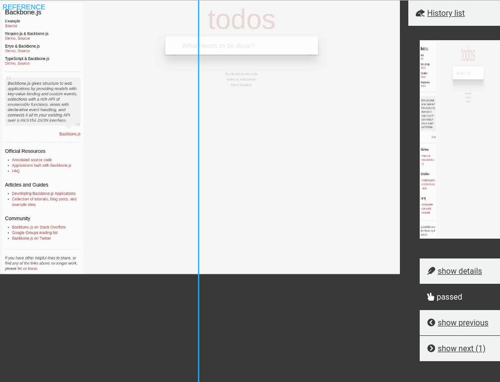

# Regression client
Regression client is a tool to view and analyse visual regression result. With it, you are able to compare and update visual differences and references. This application is for [regression-puppeteer](https://github.com/jaceyshome/regression-puppeteer).




## Getting started
These instructions will get you a copy of the project up and running on your local machine for development.


## Prerequisites
Install latest [Docker](https://docs.docker.com/install/), [docker-compose](https://docs.docker.com/compose/install/) and nodeJs 9.3.0 ( with [NVM](https://github.com/creationix/nvm) ).


## Installing
Install node modules with
```
npm install
```
or
```
yarn
```

## Running the application
Run the dev application
```
npm run dev
```
Run the production application
```
npm run prod
```

## Deployment
To build the package, run `npm build`

The `Dockerfile` is ready to use, related configuration file is `config/config-docker.js`. To build an image, set your docker repository in the `package.json`, for example
```
  "config": {
    "imageRepo": "jacobwang05/regression-client",
    "imageName": "regression-client",
    "imagePort": "7090"
  },
```
When you build an image, run
```
npm run docker:build
```
publish the image
```
npm run docker:publish
```

More details about using npm scripts for docker are in [duluca/npm-scripts-for-docker.md](https://gist.github.com/duluca/d13e501e870215586271b0f9ce1781ce/).


## Built with
[Mithril.js](https://mithril.js.org/)

[Mithril-start-kit](https://github.com/dhinesh03/mithril-starter-kit)

[PixiJs](http://pixijs.com)

[npm-scripts-for-docker.md](https://gist.github.com/duluca/d13e501e870215586271b0f9ce1781ce/)

[Webpack](https://webpack.js.org/)


## License
This project is licensed under the MIT License.


## Acknowledgments
This project is for the [regression-puppeteer](https://github.com/jaceyshome/regression-puppeteer), if you want to use for your own application, the related project is [regression-server](https://github.com/jaceyshome/regression-puppeteer), which has the restful API definition.
